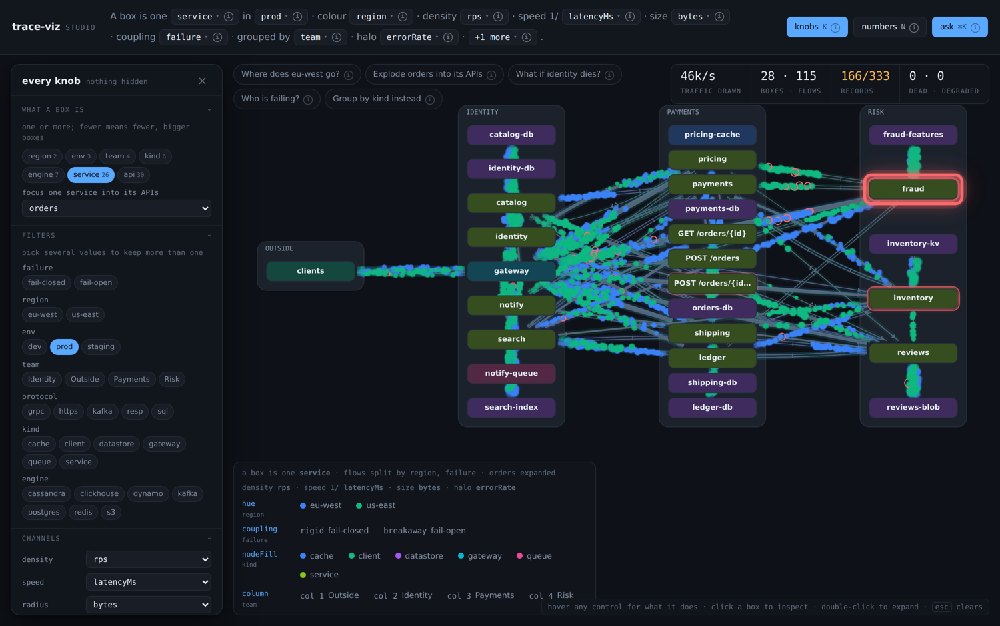
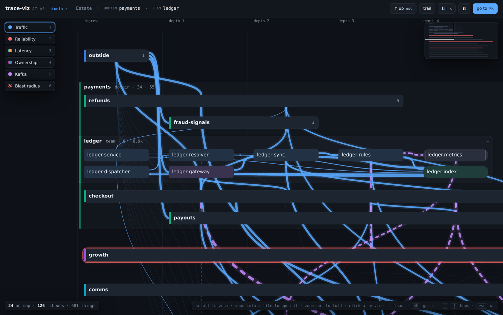
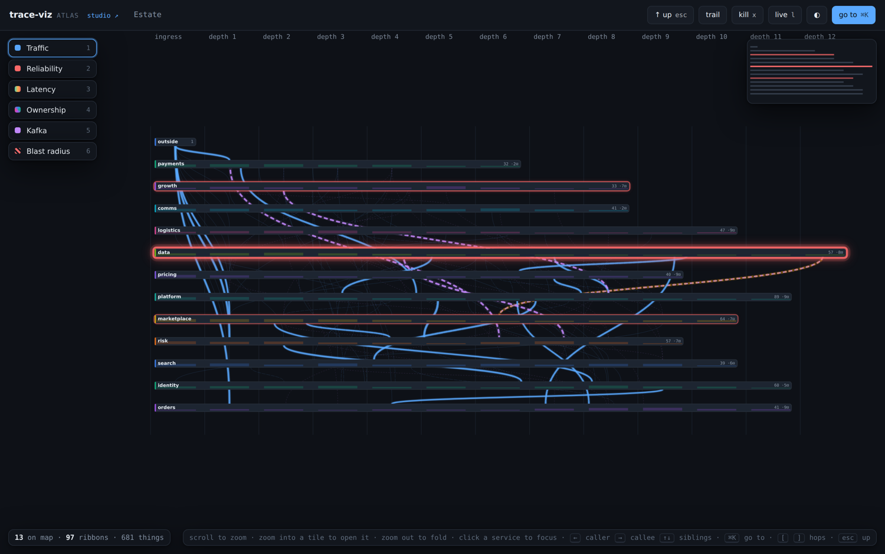
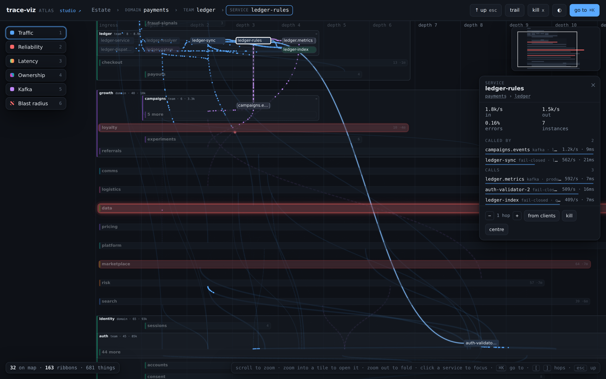
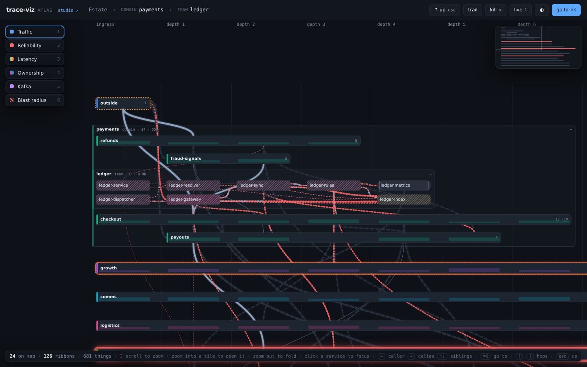
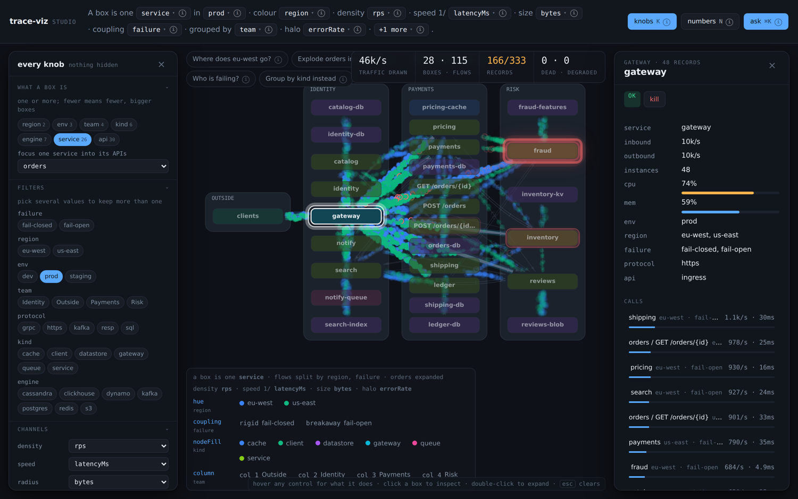
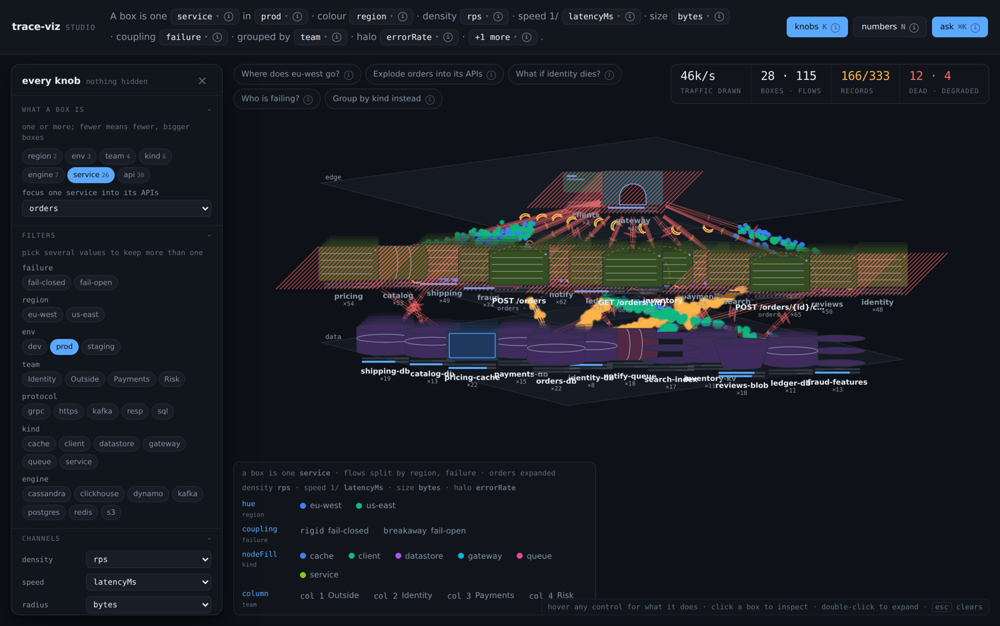

# trace-viz

Live demo: https://salujayatharth.github.io/trace-viz/

A visualization layer for service topologies. You hand it a table of flows; it
draws them as a living picture — and *which* picture is a runtime decision, not
a property of the data.

It is only a visualization layer: no agent, no collector, no opinion about where
your metrics come from. MIT licensed, zero runtime dependencies, usable from a
`<script>` tag, an ESM import, or React.

```
npm install trace-viz
```

| Studio: one picture, every knob | Atlas: 600 services as a map |
|---|---|
|  |  |
| One box per service, colour and coupling bound to dimensions | Semantic zoom over domain › team › service, Kafka topics as rails |

## Atlas: the map for large estates

Service maps stop working at a few hundred nodes, and the usual answer -
filters - throws away the context you need. **Atlas** (`/atlas.html`,
[design notes](./docs/ATLAS.md)) treats the estate as a map instead:

- **Semantic zoom.** Domains are tiles; zoom into one and it becomes a band of
  team tiles; zoom into a team and it becomes services. Everything else stays
  on the map, collapsed, with all of its traffic aggregated onto it. Zoom out
  when the map already fits and the group under the cursor folds back up.
- **Swimlanes, not force.** x is depth in the call chain, y is ownership. A
  collapsed team's tile stretches across the depths its services occupy, and a
  ribbon leaving a domain leaves at the depth the traffic actually leaves.
- **You are always somewhere.** Breadcrumbs, `⌘K` go-to, a URL that encodes
  the view, an inspector whose callers and callees are links you walk, and a
  minimap that is a heat strip of where the errors are.
- **Focus.** Click a service and its neighbourhood (k hops) opens at leaf
  level; teams that only contribute one neighbour open *partially*, folding
  their other 44 services into one "44 more" tile.
- **Kafka is not an edge.** A topic is a rail with partition ticks; producers
  land on it, consumer groups leave it, and lag fills the pipe from the left,
  amber turning red.
- **Lenses.** Traffic, Reliability, Latency, Ownership, Kafka, Blast radius -
  one click each, one meaning each.

| Domains (13 tiles, 681 things) | Focus with partial expansion | Blast radius: a store dies |
|---|---|---|
|  |  |  |

## The idea

Most service maps have one shape: a node is a box, an edge is a number. That
shape cannot express a real system, where a "service" is a dozen APIs, each API
runs in several environments and regions, every dependency has its own failure
contract, and every box is a fleet with a size and a CPU number.

Those are all *dimensions of the same traffic*. So trace-viz takes one flat
table and treats the picture as a **projection** of it:

- **What a box is** is a choice. `['service']` gives you twelve boxes;
  `['service','api']` gives you forty; `['region','service']` gives you the same
  services twice, once per region. Changing it re-projects and the mesh
  **morphs** — boxes glide, merge and split from where they were, and the
  particles stay in flight — because it is the same system seen differently, not
  a different diagram.
- **Every dimension is a knob.** Bind any dimension or measure to any visual
  channel. There is a registry of them, and adding one is how you extend this.
- **Failure semantics are first class**, not a colour. See below.

## The channels

Each channel is a separate visual property with its own resolver, so any
compatible field can drive any of them at runtime.

| Channel | Takes | What it does |
|---|---|---|
| `density` | measure | particles per second along the edge (log-scaled) |
| `speed` | measure | how fast they travel; inverted, so high values crawl |
| `radius` | measure | particle size (sqrt-scaled) |
| `hue` | dimension | particle colour, one per category |
| `glyph` | dimension | particle *shape* — readable in greyscale, so it pairs with hue |
| `dash` | dimension | the line pattern under the particles |
| `lane` | dimension | splits one edge into parallel lanes, one per category |
| `coupling` | dimension | failure semantics: a rigid conduit, or a link designed to part |
| `distance` | either | **proximity** — by default pulls on `share`, the fraction of a caller's traffic on the edge, so *coupled* services sit together; bind `rps` for raw volume, or a dimension to cluster things that share a value |
| `nodeFill` | dimension | node colour |
| `halo` | measure | a ring around a node sized by a measure — traffic through it, or a numeric fact such as `instances` |
| `column` | dimension | columns by a dimension instead of inferred layers; `order: [...]` sets the left-to-right sequence, `layout.rowSort` orders the rows (`auto` for fewest crossings, `name`, `traffic`) |

`distance` takes a `strength` (0 off, 1 default, up to 3) so coupling can be
dialled up until the clusters are unmistakable or down until the layout is calm.

Two rules the library enforces rather than documents:

**Binding a dimension to an edge channel splits the edges by it.** Colour by
region and one edge becomes two lanes, one per region. Averaging a dimension you
are also encoding would draw a colour that describes nothing.

**A channel refuses a binding it cannot show.** Forty API names will not go on
`hue`; the binding is dropped and the reason is reported, rather than rendered as
forty indistinguishable colours.

**A small split is drawn overlaid, not separated.** Two regions or three
environments share one conduit: the streams scatter across its width and emit out
of phase, so blue and green dots *mix* and you can see at a glance that this
dependency carries both — and roughly in what ratio. Two tidy parallel lanes hide
exactly that. Past three values the lanes separate, because a mixed stream of six
colours is only noise. Reciprocal edges always separate: a response must never
hide under the request it answers.

Red and amber are absent from the front of the categorical palette on purpose.
They are semantic here — red is an error, amber is degraded — and a category that
borrows one makes a healthy region look like an incident.

`share` is derived at projection time — an edge's rps over everything its
caller sends — and is what coupling means here: two services that send most of
what they have to each other are coupled whatever their absolute volume. It is
what `distance` pulls on unless you bind something else, in both the flat map
(where it weights the ordering) and the world.

Measures aggregate by kind: throughput sums, everything else is a
throughput-weighted mean. A 10k rps hop at 2ms and a 1 rps hop at 900ms do not
average to 451ms.

## Fail-closed is a first-party concept

`fail-open` and `fail-closed` are not decoration on a dependency — they are its
contract, so they get a model and a shape of their own.

- A **rigid** coupling (fail-closed) is drawn as a mechanical conduit: two rails
  with cross-ties. It looks like something that transmits force, because it does.
- A **breakaway** coupling (fail-open) has a visible parting line — a gap with
  two facing chevrons.

Then kill something. A failure front travels *backwards* up the call graph, one
hop at a time and slowly enough to watch: rigid couplings fracture and the caller
dies with the callee; breakaway couplings open, an amber shield marks where the
front stopped, and the caller is left degraded but serving. Dead nodes are
hatched, not merely greyed, so a screenshot survives being pasted into a chat.

In the bundled mesh, killing `fraud` costs you one service. Killing `identity`
takes the gateway with it. Killing `notify-queue` — the one nobody would have
guessed — takes down eight. That asymmetry is the entire argument for drawing it.

```ts
tl.kill(['identity']);
tl.stats(); // { deadNodes, degradedNodes, deadRps, degradedRps, ... }
```

## World mode

`mode: 'world'` swaps the flat topology for a small three-dimensional place:
three planes — what talks to you, what runs your code, what holds your state —
and a camera you drag to look round a cluster.

Boxes become **software**, not rectangles, chosen from a component library:
a rack for compute, a cylinder for a relational store, separated discs for a
column store, a cube for key-value, a drum for a log, a chip for a cache, a
bucket for object storage. More instances is visibly more machine; CPU and memory
ride along as gauges on the body. You can read the tier, the kind and the size of
a thing at a glance, without reading a single label.

Two deliberate choices:

- **Orthographic, not perspective.** Far things are not drawn smaller, because
  size already means the instance count and two encodings cannot share a channel.
- **Separation is computed in pixels, against the real camera.** Spacing things
  out in world coordinates achieves nothing on its own — the camera just zooms
  out to fit, leaving the overlap exactly where it was.

### Focus

Looking at one service's APIs should not turn every service into five boxes:

```ts
tl.setSpec({ ...spec, focus: { match: { service: 'orders' }, expandBy: ['api'] } });
```

`orders` explodes into its APIs, everything else stays collapsed, and the mesh
reshapes around it.

## Composing the view with a model

`trace-viz/agent` lets a model choose the projection from a plain request. It
never writes code and never draws: it selects from what is already registered —
node keys from the table's own dimensions, channels from the registry, components
from the component library — and emits a `ViewSpec`, which is then **validated
field by field** before it reaches the renderer.

```ts
import { proposeSpec, describeTable } from 'trace-viz';

const { spec, issues, source } = await proposeSpec(
  'cluster tightly coupled services in 3D and show me what fails if identity dies',
  { complete: myModelCall, schema: describeTable(table) },
);
tl.setSpec(spec);
```

A hallucinated channel, a field that does not exist, a component that was never
registered, a forty-value dimension on a colour channel — each is dropped with a
reason in `issues`, not rendered. That containment is what makes it safe to run
on every question.

**On model size.** Picking a node key and two or three bindings is well within a
small, fast model, and that is the common case. Composing a whole *world* — tiers,
per-engine components, what belongs on a gauge, what should cluster near what —
is a design task, and small models are noticeably worse at it: they put
high-cardinality dimensions on colour, flatten everything onto one tier, and skip
the dimensions that would have been informative. So the model is a parameter, not
a dependency. Use the quick tier for re-bindings and a stronger one for world
composition, and `heuristicSpec()` covers both with no model at all — which is
also what makes the tests deterministic.

## Data format

```jsonc
{
  "records": [
    {
      "from": { "service": "orders", "api": "POST /orders", "kind": "service" },
      "to":   { "service": "pricing", "api": "GET /quote", "kind": "service" },
      "dims": { "env": "prod", "region": "eu-west", "failure": "fail-open", "protocol": "grpc" },
      "metrics": { "rps": 840, "latencyMs": 18, "errorRate": 0.004, "bytes": 1400 }
    }
  ],
  "nodes": [
    {
      "key": { "service": "orders" },
      "dims": { "env": "prod", "region": "eu-west", "team": "fulfilment", "engine": "postgres" },
      "attrs": { "instances": 16, "cpu": 0.62, "mem": 0.71 },
      "component": "db-cylinder"
    }
  ]
}
```

`from` and `to` are coordinates in dimension space, not ids — what counts as a
node is decided later. `dims` are dimensions of the flow itself. `nodes` are facts
about *things* rather than flows, and they attach at whatever resolution the
current projection happens to use: a fact keyed `{service: 'orders'}` lands on the
single `orders` box, and on every `orders / <api>` box when you expand it. Counts
sum; everything else is instance-weighted.

The v0.1 flat `{nodes, edges}` graph still works unchanged via `setGraph`.

## Quick start

```html
<div id="map" style="height: 720px"></div>
<script src="https://unpkg.com/trace-viz/dist/trace-viz.min.js"></script>
<script>
  const { TraceLight, generateMesh } = tracelight; // the script-tag global keeps the library's internal name
  const tl = new TraceLight(document.getElementById('map'), { theme: 'auto' });
  tl.setTable(generateMesh(), {
    nodeKey: ['service'],
    where: { env: ['prod'], region: ['eu-west'] },
    mode: 'world',
    channels: { coupling: { field: 'failure' }, distance: { field: 'rps' } },
    world: { instances: 'instances', gauges: ['cpu', 'mem'] },
  });
</script>
```

React:

```tsx
import { TraceLightView } from 'trace-viz/react';
<TraceLightView graph={graph} theme="auto" style={{ height: 720 }} />;
```

The renderer owns the canvas and the animation loop, so React re-renders never
restart the particle streams.

## Numbers are off by default

Every edge can print its rps and latency, and by default none of them do. On a
real topology the numbers turn a legible picture into a wall of small type, and
they duplicate work the visuals already do better: throughput is particle density
*and* conduit thickness, latency is how fast the particles crawl. The exact
figures live one hover away, where you want them when you want them, and
`showEdgeLabels: true` puts them back for the tasks that are about reading
figures rather than seeing shape.

## The particles

Each request is a soft-edged point of light with a short tail behind it along
its path. The tail's length is the particle's own speed, so a fast hop streaks
and a slow one crawls, and the eye reads motion rather than a dot that happens
to be somewhere else next frame. Overlapping lanes blend instead of occluding.
The defaults say what they encode: `density` is rps, `speed` is 1/latency,
`size` is bytes, `colour` is whatever dimension you bind. Particle *shape* is
parked until the particle system itself has settled.

In world mode the camera orbits on its own — a full turn in about two minutes —
so the depth of the mesh keeps revealing itself; it pauses under the pointer and
while you drag, and `orbit: false` turns it off.

## On the pacing

The animation is deliberately slow. An earlier, faster set of defaults looked
impressive and told you nothing: at 260px/s the streams read as texture, and
texture cannot be counted. Slower and sparser means one request is a thing you
can watch leave one box and arrive at the next, which is the only reason to draw
them individually instead of writing a number on a line. `speed` scales it;
`prefers-reduced-motion` switches to a static rendering where throughput moves
into line width.

## Where the data comes from

One interface, so a static file today and a live feed later are the same thing to
the renderer:

```ts
interface GraphSource {
  load(): Promise<Graph>;
  subscribe?(onGraph: (g: Graph) => void, onError?: (e: Error) => void): () => void;
}
```

Shipped: `fromObject`, `fromUrl(url, { pollMs })`, `fromEventSource`,
`pollSource`. Planned, in order: a **SQLite adapter** (a `flows` table read
Node-side and rolled up per time bucket, which also gives you a scrubber over
history), then **interpolation between snapshots** so live density eases into its
new value instead of stepping. Collecting the metrics is deliberately out of
scope.

## Demos

```bash
npm install && npm run build && npm run demo   # → http://localhost:4173
```

- `/studio.html` — the studio. The view spec is an editable sentence across the
  top ("A box is one **service** in **prod** · colour **region** · density
  **rps** · speed 1/**latencyMs** · size **bytes** · coupling **failure** ·
  cluster **share** · columns **team**"); click any token to change it. The
  opening view fills boxes by kind, halos them by instance count, arranges them
  in team columns, and explodes the gateway's call into `orders` to API level. Click anything
  on the canvas to inspect it, double-click a service to explode it into its
  APIs, hover a legend swatch to isolate that value in context, ⌘K to ask for a
  view in words. Five one-click scenarios along the top show what the framework
  is for. The sentence is the fast path; `K` opens the **knobs** drawer, which is
  the complete one — every dimension as a multi-value filter, all twelve
  channels, the world's tier/shape/mass/gauge/camera settings, playback, a
  multi-kill panel, and the raw spec as editable JSON with apply, copy, PNG
  export and reset. Nothing the renderer takes is hidden from it.
- `/atlas.html` — the map: `generateEstate()` (600 services, 80 topics, 12
  domains, 61 teams) with semantic zoom, lenses, focus, trails and blast radius.
- `/mesh.html` — the same data with plain controls, for reference
- `/index.html` — the small one: an API whose auth costs two round trips per call

| Studio, map | Studio, world under a kill |
|---|---|
|  |  |

## API

| Export | What it is |
|---|---|
| `TraceLight` | the renderer: `setGraph`, `setTable`, `setSpec`, `kill`, `health`, `select`, `setHighlight`, `setYaw`, `stats`, `schema`, `getLegend`, `toDataURL` |
| `TraceLightView` (`trace-viz/react`) | React wrapper |
| `project`, `describeTable` | projection and schema introspection |
| `CHANNELS`, `styleScene` | the channel registry and its resolver |
| `COMPONENTS`, `pickComponent` | the world component library |
| `layoutWorld`, `fitCamera`, `project3` | the 3D layout, usable on its own |
| `propagateFailure` | blast radius, without a canvas |
| `proposeSpec`, `validateSpec`, `heuristicSpec` | the spec agent and its validator |
| `generateMesh`, `generateSeedGraph`, `generateEstate`, `authChallengeScenario` | seed data |
| `Atlas`, `LENSES` | the map: `setTable`, `expand`, `collapse`, `up`, `focus`, `setHops`, `goTo`, `search`, `inspect`, `breadcrumb`, `setLens`, `kill`, `revive`, `setTrail`, `fit`, `drawMinimap`, `getState`/`setState` |
| `buildAtlas`, `visibleUnits`, `aggregateEdges`, `layoutAtlas`, `neighbourhood`, `trail`, `propagate` | the Atlas model, usable without a canvas |

## Development

```bash
npm run typecheck
npm test           # 38 tests, no browser needed
npm run build
npm run screenshots
```

## License

MIT — see [LICENSE](./LICENSE). Use it for anything, commercial included.
